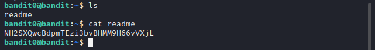
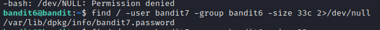

# __BANDIT__

<span>
:octicons-calendar-24: October 18, 2022 ·
:octicons-clock-24: ~5 minutes

</span>

---

## __Tìm password từng level__

### __LEVEL 0__
#### Trích dẫn đề bài

??? quote "__Level Goal__"
    The goal of this level is for you to log into the game using SSH. The host to which you need to connect is bandit.labs.overthewire.org, on port 2220. The username is bandit0 and the password is bandit0. Once logged in, go to the Level 1 page to find out how to beat Level 1.


Ở thử thách này, yêu cầu dùng ssh để truy cập tới host __bandit.labs.overthewire.org__ ở port 2220 với password là ==bandit0==, dễ dàng ta có thể kết nối được và kết quả như hình bên dưới:


### __LEVEL 0 → LEVEL 1__
#### Trích dẫn đề bài

??? quote "__Level Goal__"
    The password for the next level is stored in a file called readme located in the home directory. Use this password to log into bandit1 using SSH. Whenever you find a password for a level, use SSH (on port 2220) to log into that level and continue the game.

Ở thử thách này thì như trên đề bài đã nói, password sẽ lưu ở trong 1 file có tên là readme và được lưu ở thư mục home. Ta chỉ cần đọc file readme bằng cú pháp ==cat readme== là sẽ lấy được password. Mô tả như hình dưới:


### __LEVEL 1 → LEVEL 2__
#### Trích dẫn đề bài

??? quote "__Level Goal__"
    The password for the next level is stored in a file called - located in the home directory

Ở thử thách này thì như trên đề bài đã nói, password sẽ lưu ở trong 1 file có tên là ==-== và được lưu ở thư mục home. Vì tên file này khá đặc thù nên ta cần cat đúng đường dẫn bằng cách ==cat ./-== để mở file hoặc có thể ta dùng ==cat <-== để mở file, và kết quả như hình bên dưới:


### __LEVEL 2 → LEVEL 3__
#### Trích dẫn đề bài

??? quote "__Level Goal__"
    The password for the next level is stored in a file called spaces in this filename located in the home directory.

Ở thử thách này thì như trên đề bài đã nói, password sẽ lưu ở trong 1 file có tên là ==spaces in this filename== và được lưu ở thư mục home. Vì đây là tên file có dấu cách nên không thể nào ta dùng ==cat spaces in this filename== được, nó sẽ báo lỗi ngay. Lúc này, ta chỉ cần dùng cặp dấu nháy kép để terminal có thể hiểu và thực thi những gì ta cần. Cú pháp ==cat "spaces in this filename"== và kết quả password được hiện ra như hình sau:


### __LEVEL 3 → LEVEL 4__
#### Trích dẫn đề bài

??? quote "__Level Goal__"
    The password for the next level is stored in a hidden file in the inhere directory.

Thử thách này cung cấp cho chúng ta kiến thức về cách đọc tập tin ẩn bằng lệnh cat. Trước tiên ta phải liệt kê các file bị ẩn bằng lệnh ==ls -a== và sau đó ta biết chính xác được file ẩn thì dễ dàng có thể ==cat + "file ẩn"== để lấy password.


### __LEVEL 4 → LEVEL 5__
#### Trích dẫn đề bài

??? quote "__Level Goal__"
    The password for the next level is stored in the only human-readable file in the inhere directory. Tip: if your terminal is messed up, try the “reset” command.

Khi ta kết nối đến user này, ta thấy trong thư mục inhere có rất nhiều file. Kết hợp với đề bài ta cần phải biết chính xác loại file của các file và ta có script sau:

``` shell linenums="1"
for x in {0..9}; do file ./-file0$x; done 
```

Với đoạn script trên, ta thấy file07 là file duy nhất khác kiểu dữ liệu với các file khác. Tiến hành cat file07 ra và ta có password cần tìm.


### __LEVEL 5 → LEVEL 6__
#### Trích dẫn đề bài

??? quote "__Level Goal__"
    The password for the next level is stored in a file somewhere under the inhere directory and has all of the following properties:

    - human-readable
    - 1033 bytes in size
    - not executable

    
Với yêu cầu cụ thể như trên, ta sử dụng pasword phía trên, kiểm tra các file bên trong bằng ls và cd, ta thấy bên trong có nhiều file nhỏ, sử dụng vòng lặp for như bên trên không khả quan. 


Tiếp đến, ta sử dụng lệnh find  với các option như -type -size, -executable để tìm file hợp yêu cầu, cụ thể find -type f -size 1033c  ! -executable 


### __LEVEL 6 → LEVEL 7__
#### Trích dẫn đề bài

??? quote "__Level Goal__"
    The password for the next level is stored somewhere on the server and has all of the following properties:

    - owned by user bandit7
    - owned by group bandit6
    - 33 bytes in size

    
Ở thử thách này, password được lưu trữ ở một nơi nào đó trong server và có các thuộc tính: thuộc sở hữu của user bandit7, thuộc group bandit6 và có kích thước là 33 byte. Điều ta sẽ làm lúc này là:

- Sử dụng lệnh find để tìm file.
- Sử dụng lệnh find để tìm file.
- Sử dụng option -user để tìm thuộc tính user
- Sử dụng option -group để tìm thuộc tính group
- Tuy nhiên, nếu chỉ dừng lại ở đó thì sẽ xuất ra rất nhiều kết quả permisson 

__Lưu ý:__ Thêm `2>dev>null` để chuyển thông báo lỗi đến null và ta được password như hai hình bên dưới




### __LEVEL 7 → LEVEL 8__
#### Trích dẫn đề bài

??? quote "__Level Goal__"
    The password for the next level is stored in the file __data.txt__ next to the word __millionth__

    
Ở thử thách này, ta tiến hành đọc file data.txt, ta thấy cấu trúc của file là 1 từ sẽ đứng kề 1 password và lọc kết quả theo từ khóa __millionth__ thì vấn đề sẽ được giải quyết.


### __LEVEL 8 → LEVEL 9__
#### Trích dẫn đề bài

??? quote "__Level Goal__"
    The password for the next level is stored in the file __data.txt__ and is the only line of text that occurs only once

    
Ở thử thách này, ta kiểm tra file data.txt, ta thấy file data.txt là 1 đoạn password và dựa vào gợi ý, ta phải tìm trong đó chuỗi kí tự chỉ lặp lại 1 lần duy nhất. 


Để tìm password, ta sử dụng 2 câu lệnh là sort và uniq với công dụng là sort – sắp xếp và uniq -  là lệnh xóa lặp với option -u là chỉ in dòng xuất hiện 1 lần.


### __LEVEL 9 → LEVEL 10__
#### Trích dẫn đề bài

??? quote "__Level Goal__"
    The password for the next level is stored in the file __data.txt__ in one of the few human-readable strings, preceded by several ‘=’ characters.

    
Ở thử thách này, ta kiểm tra file data.txt, ta có kết quả như sau


Sau đó, ta sẽ dùng lệnh cat để đọc file, lệnh strings để lọc chuỗi và lệnh grep để lọc hàng có kí tự ‘=’ và tìm được password như hình dưới


