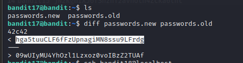

# __BANDIT__

:octicons-calendar-24: October 18, 2022 ·
:octicons-clock-24: ~5 minutes

---

### __LEVEL 11 → LEVEL 12__
#### Trích dẫn đề bài

??? quote "__Level Goal__"
    The password for the next level is stored in the file __data.txt__, where all lowercase (a-z) and uppercase (A-Z) letters have been rotated by 13 positions

Ở thử thách này, việc hiểu tiếng anh cũng là điều thật sự cần thiết. Và tôi có tóm tắt những ý như sau:

- Password được lưu trong data.txt và kí tự thường và kí tự hoa bị xoay 13 vị trí.
- Dùng câu lệnh tr để xoay lại vị trí của kí tự thường và hoa.
- Vì 13 vị trí nên A-Z sẽ đổi ngược lại thành N-Z và A-M. a-z sẽ thành n-za-m.
- Cụ thể, câu lệnh là cat data.txt | tr ‘[A-Za-z]’ ‘[N-ZA-Mn-za-m]’

### __LEVEL 12 → LEVEL 13__
#### Trích dẫn đề bài

??? quote "__Level Goal__"
    The password for the next level is stored in the file data.txt, which is a hexdump of a file that has been repeatedly compressed. For this level it may be useful to create a directory under /tmp in which you can work using mkdir. For example: mkdir /tmp/myname123. Then copy the datafile using cp, and rename it using mv (read the manpages!)

Ở thử thách này, ta chuyển data.txt sang địa chỉ mới. Kiểm tra file thì thấy file là hexdump

Tiếp theo, ta sử dụng lệnh xxd -r  để chuyển ngược hexdump về gốc và lưu thành file test

Sau cùng, ta dùng lệnh file  để kiểm tra file test được nén bởi công cụ gì.

Nhận thấy file test được nén bằng gzip nên ta sẽ dùng gzip để giải nén file. Mà trước đó ta phải thêm đuôi .gz để công cụ gzip có thể được sử dụng. Dùng lệnh gzip -d test.gz để giải nén, ta được file mới tên là test, kiểm tra file test đó bằng lệnh file, ta được file test được  nén bằng bzip2.

Tiếp tục dùng công cụ bzip2 để giải nén nhưng phải đổi tên sang test.bz2

Sau khi dùng bzip2 giải nén, ta thu được file test, tiếp tục kiểm tra file test, ta được test được nén bởi gzip. Làm tương tự như trên, đổi tên có đuôi gz rồi giải nén, ta được 

Ta thu được file test, kiểm tra ta thấy test được nén bởi tar. Ta đổi tên để thêm đuôi .tar và dùng lệnh tar -xf test.tar để giải nén.

Tiếp tục ta được file data5.bin, tiếp tục kiểm tra và vẫn dùng tar để giải nén.

Tiếp tục ta được data6.bin, ta dùng bzip2 để giải nén.

Ta thu được file data6, kiểm tra và thấy được nén bằng tar. Dùng tar giải nén, ta được file data8.bin

Tiếp tục dùng gzip để giải nén. Ta được file data8, đây là file ASCII nên đọc file và lấy password.

### __LEVEL 13 → LEVEL 14__
#### Trích dẫn đề bài

??? quote "__Level Goal__"
    The password for the next level is stored in /etc/bandit_pass/bandit14 and can only be read by user bandit14. For this level, you don’t get the next password, but you get a private SSH key that can be used to log into the next level. Note: localhost is a hostname that refers to the machine you are working on

Với thử thách này, password lưu trữ trong /etc/bandit_pass/bandit14 và chỉ được đọc bởi user bandit14. Nhưng level này không lấy password cho lv tiếp theo mà lấy private ssh key để đăng nhập vào level tiếp theo.

Kiểm tra, ta được sshkey của level tiếp theo.

Dùng lệnh ssh -i sshkey.private ==bandit14@bandit.labs.overthewire.org -p 2220== ta sẽ được qua level 14 → level 15.

### __LEVEL 14 → LEVEL 15__
#### Trích dẫn đề bài

??? quote "__Level Goal__"
    The password for the next level can be retrieved by submitting the password of the current level to __port 30000 on localhost.__

Yêu cầu dùng password của level trước gửi đến localhost port 30000.

Ta dùng lệnh `nc localhost 30000`

### __LEVEL 15 → LEVEL 16__
#### Trích dẫn đề bài

??? quote "__Level Goal__"
    The password for the next level can be retrieved by submitting the password of the current level to __port 30001 on localhost__ using SSL encryption.

    __Helpful note: Getting “HEARTBEATING” and “Read R BLOCK”? Use -ign_eof and read the “CONNECTED COMMANDS” section in the manpage. Next to ‘R’ and ‘Q’, the ‘B’ command also works in this version of that command…__

Với thử thách này, ta chỉ cần làm giống gợi ý là hoàn thành.

### __LEVEL 16 → LEVEL 17__
#### Trích dẫn đề bài

??? quote "__Level Goal__"
    The credentials for the next level can be retrieved by submitting the password of the current level to a port on localhost in the range 31000 to 32000. First find out which of these ports have a server listening on them. Then find out which of those speak SSL and which don’t. There is only 1 server that will give the next credentials, the others will simply send back to you whatever you send to it.

Ta sẽ sử dụng công cụ nmap để dò port mở trên localhost bằng option -sV `nmap -sV -p31000-32000 localhost`

Ta thấy có 2 cổng SSL mở là 31518 và 31790. Port 31518 là ‘echo’ port nên ta sẽ connect đến port 31790.

Dùng lệnh `openssl s_client -connect localhost:31790`

Sau đó, ta được trả về một khóa mật RSA

Lưu RSA key vào file RSA để tiện sử dụng. Sử dụng câu lệnh `ssh -I RSA bandit17@localhost -p 2220`

### __LEVEL 17 → LEVEL 18__
#### Trích dẫn đề bài

??? quote "__Level Goal__"
    There are 2 files in the homedirectory: __passwords.old and passwords.new__. The password for the next level is in passwords.new and is the only line that has been changed between __passwords.old and passwords.new__

    __NOTE: if you have solved this level and see ‘Byebye!’ when trying to log into bandit18, this is related to the next level, bandit19__

Với thử thách này, ta chỉ cần làm giống gợi ý là hoàn thành.

### __LEVEL 18 → LEVEL 19__
#### Trích dẫn đề bài

??? quote "__Level Goal__"
    The password for the next level is stored in a file __readme__ in the homedirectory. Unfortunately, someone has modified __.bashrc__ to log you out when you log in with SSH.

Nếu dùng password tìm được ở câu trên sử dụng cho level 18 bằng câu lệnh `ssh -p 2220 bandit18@bandit.labs.overthewire.org` thì sẽ xuất ra màn hình `Byebye !` rồi kết thúc.

Vì vậy, ta phải sử dụng câu lệnh `ssh -p 2220 bandit18@bandit.labs.overthewire.org cat readme` với mục đích đọc file readme và sau đó mới nhập password từ level trên.

### __LEVEL 19 → LEVEL 20__
#### Trích dẫn đề bài

??? quote "__Level Goal__"
    To gain access to the next level, you should use the setuid binary in the homedirectory. Execute it without arguments to find out how to use it. The password for this level can be found in the usual place (/etc/bandit_pass), after you have used the setuid binary.

Dùng file nhị phân để tìm password được lưu trữ trong đường dẫn /etc/bandit_pass

### __LEVEL → 20 LEVEL 21__
#### Trích dẫn đề bài

??? quote "__Level Goal__"
    There is a setuid binary in the homedirectory that does the following: it makes a connection to localhost on the port you specify as a commandline argument. It then reads a line of text from the connection and compares it to the password in the previous level (bandit20). If the password is correct, it will transmit the password for the next level (bandit21).

    __NOTE:__ Try connecting to your own network daemon to see if it works as you think

    
Với thử thách này, ta cần tạo thêm 1 cổng kết nối ảo và gửi password từ LEVEL 19 đã nhận được đến kết nối đó, để server có thể so sánh và trả về password của thử thách này.

