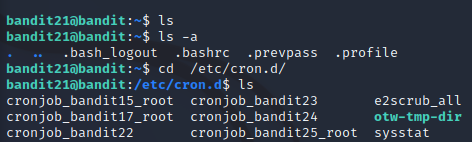
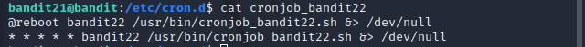
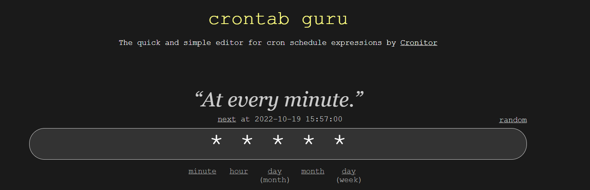
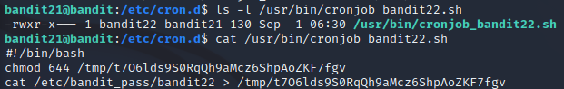
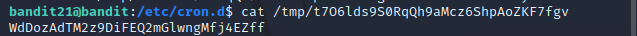
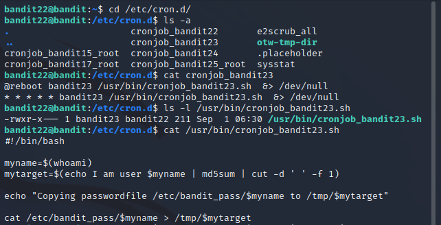
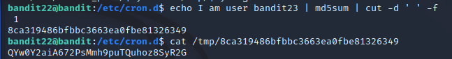

# __BANDIT__

:octicons-calendar-24: October 18, 2022 ·
:octicons-clock-24: ~5 minutes

---

### __LEVEL → 21 LEVEL 22__
#### Trích dẫn đề bài

??? quote "__Level Goal__"
    A program is running automatically at regular intervals from cron, the time-based job scheduler. Look in /etc/cron.d/ for the configuration and see what command is being executed.

    
Với thử thách này, ta cần xem xem cron có gì ở trong đấy theo đường dẫn mà đề bài gợi ý

Với hình trên, ta thấy file cronjob_bandit22. Tôi nghĩ đó là file mà thử thách này muốn hướng đến. Tiến hành xem tệp tin cronjob_bandit22 như hình bên dưới:

Tôi thấy có điều gì đó lạ lạ ở đây giữa 5 dấu *. Và tôi tiến hành google cú pháp của cron bằng từ khóa ==cron job syntax==[^1]. Tôi tiến hành chỉnh sửa các tham số * và thấy được kết quả rằng đoạn shell đó thực thi mỗi phút một lần như hình dưới

Lúc này, tôi quyết định xem xem rốt cuộc tệp tin cronjob_bandit22 định làm gì thì nhận thấy nó thực thi và ghi vào trong file thuộc đường dẫn /tmp/t7O6lds9S0RqQh9aMcz6ShpAoZKF7fgv như hình dưới

Đến đây cũng là xong thử thách, tôi chỉ việc cat file ra để lấy password thôi.

### __LEVEL → 22 LEVEL 23__
#### Trích dẫn đề bài

??? quote "__Level Goal__"
    A program is running automatically at regular intervals from cron, the time-based job scheduler. Look in /etc/cron.d/ for the configuration and see what command is being executed.

    __NOTE:__ Looking at shell scripts written by other people is a very useful skill. The script for this level is intentionally made easy to read. If you are having problems understanding what it does, try executing it to see the debug information it prints.

Dưới đây là hình ảnh tôi tìm ra password.

Tương tự như level 21, ở level này tôi cũng xem file `cronjob_bandit23.sh` nó làm gì ở trong đó. Thì tôi nhận ra rằng đường dẫn chứa password nó phụ thuộc vào giá trị của biến `mytarget`. Mặc khác, biến `mytarget` phụ thuộc vào script `echo I am user $myname | md5sum | cut -d ' ' -f 1`. Hơn nữa, script đã cho cũng phụ thuộc vào tham số `$myname` được truyền vào để có thể tính toán đúng. Vì đây đang là level 23 nên tham số truyền vào tôi đoán là bandit23. Và tôi đã đúng. Do đó tôi tách script ra thực thi để lấy tên tệp. Và cuối cùng tôi đã tìm ra password.

### __LEVEL → 23 LEVEL 24__
#### Trích dẫn đề bài

??? quote "__Level Goal__"
    A program is running automatically at regular intervals from cron, the time-based job scheduler. Look in /etc/cron.d/ for the configuration and see what command is being executed.

    __NOTE:__ This level requires you to create your own first shell-script. This is a very big step and you should be proud of yourself when you beat this level!

    __NOTE 2:__ Keep in mind that your shell script is removed once executed, so you may want to keep a copy around…

Tương tự như level 22, ở level này tôi xem file `cronjob_bandit24.sh` nhưng file này tương đối dễ đọc và dễ hiểu. 

!!! question "Câu hỏi"
    Làm sao ta có thể xác minh được username __bandit23__ hay __bandit24__ đang thao tác với shell?

## __Tham khảo thêm__

[:octicons-arrow-right-24: Xem challenge trên website bandit][website bandit]

  [website bandit]: https://overthewire.org/wargames/bandit/

[^1]: Theo trình duyệt nó dẫn tôi đến website [https://crontab.guru/](https://crontab.guru/)